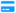
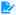

# Estudiante 

¡Bienvenido al Módulo de Estudiante! En el Panel de Estudiantes, encontrarás accesos rápidos a funciones esenciales. La opción de Pago en Línea te permite abonar tus parcialidades de manera ágil y segura. Además, puedes generar referencias bancarias para pagos y consultar tu historial detallado de transacciones financieras. Por último, la función de Consulta de Calificaciones te brinda acceso instantáneo a tu rendimiento académico. Explora estas funcionalidades diseñadas para hacer tu trayecto académico más eficiente y accesible.

## Pago en Línea

 Sigue estos pasos para realizar tu **Pago en Línea**.

:::info pasos:

1. Accede a tu cuenta de **Gedux** con tu usuario o correo institucional.

2. En el **Panel del Estudiante** dirígete a la sección de **Próximo Pago** y haz clic en " **Pagar**"

3. En la ventana de **Pago de mensualidad** se muestran los conceptos a pagar, selecciona los que pagarás.

4. Una vez seleccionados haz clic en "**Continuar**".

5. Confirma haciendo clic en "**Aceptar**" y luego "**Pagar**".

6. Se abrirá una ventana donde tienes que completar el formulario con los datos de tu tarjeta.

7. Haz clic en ""**Pagar**".
:::
___

## Pago Referenciado

 Para realizar el pago de tu mensualidad usando **Pago Referenciado** sigue estos pasos:

📢***Importante:*** Te sugerimos que descargues las referencias el mismo día que realices el pago, pues al vencimiento de tu mensualidad tus referencias cambiarán.

:::info Sigue estos pasos:

1. Accede a tu cuenta de **Gedux** con tu usuario o correo institucional.

2. En el **Panel del Estudiante** dirígete a la sección "**Referenciado**" y haz clic en " **Generar**".

3. Haz clic en el botón " **Exportar**" para obtener el archivo **PDF** de tu referencia bancaria.

4. Realiza el pago de la referencia bancaria proporcionada para completar la transacción.

   📢***Importante:*** Asegúrate de que tus datos personales y la información de pago sean correctos antes de pagar la referencia.
:::
___

## Mis pagos

En esta sección, podrás ver una lista detallada de todos tus pagos anteriores. Si necesitas comprobantes o detalles adicionales de algún pago en particular, puedes descargar el comprobante.

:::info Para revisar el historial de tus pagos, sigue estos pasos:

1. Accede a tu cuenta de **Gedux** con tu usuario o correo institucional.

2. Tienes 2 opciones para consultar tus pagos:
    
    a) En el **Panel del Estudiante** dirígete a la sección **Pagos de Parcialidades** y selecciona "** Más Pagos**".

    b) En menú de "**Accesos directos**" selecciona "**Mis Pagos**".

3. Se muestran los pagos. Haz clic en un concepto para ver más detalles.

4. Tienes la opción de descargar el comprobante haciendo clic en "**Descargar**".
:::
___

## Calificaciones

:::info Para revisar el historial de tus pagos, sigue estos pasos:

1. Accede a tu cuenta de **Gedux** con tu usuario o correo institucional.

2. Tienes 2 opciones para consultar tus **Calificaciones**:
    
    a) En el **Panel del Estudiante** dirígete a la sección **Datos del Usuario** y selecciona "** Calificaciones**".

    b) En menú de "**Accesos directos**" selecciona "**Calificaciones**".

3. Se muestran una ventana con el resumen de las **Evaluaciones**.
:::
___
:::tip ¿Necesitas más ayuda?
Recuerda escribirnos si tienes inquietudes sobre este u otros procesos en **Gedux**. Nuestro **Equipo de Soporte** está listo para ayudarte.
:::

export const Highlight = ({children, color}) => (
  
    {children}
  
);

¿Te resultó útil este artículo? <Highlight color="#B0AEAC">[Si](https://forms.gle/LP9LYvbSWSSDwAau7)</Highlight> <Highlight color="#B0AEAC">[No](https://forms.gle/LP9LYvbSWSSDwAau7)</Highlight> 
