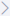
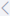

# Generaciones

Dentro del Menú de Generaciones, se te ofrece una variedad de funciones para administrar efectivamente las generaciones académicas. Puedes crear nuevas generaciones, editar las ya existentes o eliminarlas según tus necesidades. Además, tienes la opción de iniciar las generaciones y gestionar los periodos y ciclos asociados a cada una. En este menú, también puedes administrar documentos esenciales para la generación y llevar a cabo la importación de evaluaciones finales. La gestión de asignaturas es integral, ya que puedes crear, editar o eliminar asignaturas y asignaturas optativas, además de definir los cupos para estas asignaturas.

## Crea Generaciones

:::info SIGUE ESTOS PASOS PARA crear una generación:

1. Ingresa al módulo **"Control Escolar"** y selecciona **"Generaciones"** en el menú de "**Accesos Directos**".

2. Selecciona el icono " **Adicionar Generación**".

3. Completa el **Formulario** con la información solicitada. Más adelante puedes ver su explicación.

4. Finaliza haciendo clic en el botón "**Aceptar**".
:::

En el paso número 3 completa los campos del formulario con la siguiente información:

**Formulario "Crear Generación"**

* **Campaña:** Selecciona una **Campaña**. Esta es creada por el departamento **"Admisiones"**.

* **Nivel:** Selecciona una opción.

* **Modalidad:** Selecciona una opción.

* **Carrera:** Selecciona una opción.

* **Plan de Estudio:** Selecciona una opción.

* **Inicio de la Generación:** Ingresa la fecha de inicio.

* **Fin de Generación:** Ingresa la fecha de fin.

    ***📌Nota:*** El sistema automáticamente ingresa el **Nombre Corto** y **Nombre Completo** al completar los datos anteriores. De igual manera puedes modificarlos según las necesidades.

* **Descripción:** De forma opcional puedes ingresar un comentario sobre lo que estás creando.
___

## Editar Generaciones

Dependiendo de la actividad o necesidad, pueden requerir hacer modificaciones, es por ello que **Gedux** permite editar las **"Generaciones"**.

:::info SIGUIENDO ESTOS PASOS:

1. Dirígete al módulo de **"Control Escolar"** y selecciona **"Generaciones"** en el menú de "**Accesos Directos**".

2. Busca filtrando por **Código** de **Generación**, **Nombre** o **RVOE** y selecciona la **Generación** que editarás.

3. Selecciona el icono "" y haz clic en "** Editar Generación**".

4. Completa el **Formulario** con la información que deseas editar.

5. Presiona **"Aceptar"** para guardar los cambios.
:::
___

## Eliminar Generaciones

:::info Pasos para eliMINAR generaciones:
1. Dirígete al módulo de **"Control Escolar"¨** y selecciona **"Generaciones"** en el menú de "**Accesos Directos**".

2. Busca filtrando por **Código** de **Generación**, **Nombre** o **RVOE** y selecciona la **Generación** que eliminarás.

3. Selecciona el icono "" y haz clic en "** Eliminar Generación**".

4. Confirma la operación introduciendo el **Código de Generación** y selecciona **"Aceptar"** para finalizar.
:::
___

## Iniciar Generación

:::info Indica cuando iniciará la nueva **Generación**:

1. Dirígete al módulo de **"Control Escolar"** y selecciona **"Generaciones"** en el menú de "**Accesos Directos**".

2. Busca filtrando por **Código** de **Generación**, **Nombre** o **RVOE** y selecciona la **Generación** que iniciara.

3. Selecciona el icono "" y haz clic en "** Iniciar Generación**".

4. Completa el **Formulario** con la información solicitada.

5. Finaliza haciendo clic en el botón "**Aceptar**".
:::

En el paso número 4 completa los campos del formulario con la siguiente información:

**Formulario "Iniciar Generación"**

* **Nombre:** Completa este espacio ingresando el nombre del **Primer Periodo**.

* **Nombre:** ingresa el nombre del **Primer Ciclo**.

* **Fecha Inicio:** Selecciona una **Fecha de Inicio**.

* **Fecha de Fin:** Selecciona una **Fecha de Fin**.
___

## Periodos y Ciclos

En esta opción puedes visualizar y Editar los **Periodos y Ciclos**. 

:::info sigue estos pasos:

1. Dirígete a **"Control Escolar"** y selecciona **"Generaciones"** en el menú de "**Accesos Directos**".

2. Busca filtrando por **Código** de **Generación**, **Nombre** o **RVOE** y selecciona la **Generación** que utilizaras.

3. Selecciona el icono "" y haz clic en "".

4. En el **Listado de Versiones de Periodos** puedes:

    * ** Ver Detalles**: Visualiza los detalles del periodo seleccionado.

    * ** Ver/Editar Ciclos**: Puedes ver y editar los **Ciclos** del **Periodo** seleccionado. 

        * **Listado de Ciclos**: Puedes editar, ver o editar los ciclos seleccionando "" o "".
    
    * ** Editar Periodo**: Edita el nombre y orden del **Periodo** seleccionado

5. Presiona **"Aceptar"** para guardar los cambios.

:::
___

## Lista de Chequeo de Titulación

En esta opción puedes crear y gestionar condiciones que debe cumplir un **Estudiante** para poder titularse.

:::info Pasos para adicionar condiciones:

1. Dirígete a **"Control Escolar"** y selecciona **"Generaciones"** en el menú de "**Accesos Directos**".

2. Busca filtrando por **Código** de **Generación**, **Nombre** o **RVOE** y selecciona la **Generación** que crearas condiciones de titulación.

3. Selecciona el icono "" y haz clic en "** Lista de Chequeo de Titulación**".

4. Selecciona el icono " **Adicionar Elemento de Chequeo**".

5. Completa el **Formulario** con la información que deseas editar.

6. Finaliza haciendo clic en el botón "**Aceptar**".
:::

En el paso número 5 completa los campos del formulario con la siguiente información:

**Formulario "Crear Elemento de Chequeo"**

* **Nombre:** Completa este campo con el nombre de la condición.

* **Habilitado:** Selecciona para habilitar la condición, desmarca para inhabilitar.

* **Tipo:** Selecciona el tipo de condición

* **Descripción:** De forma opcional puedes ingresar un comentario sobre lo que estás creando.
___

## Lista de Documentos

En este menú puedes seleccionar documentos requeridos obligatorios para la Generación. De igual manera se puede dejar de forma opcional.

 
:::info Pasos para adicionar documentos:

1. Dirigete a **"Control Escolar"** y selecciona **"Generaciones"** en el menú de "**Accesos Directos**".

2. Busca filtrando por **Código** de **Generación**, **Nombre** o **RVOE** y selecciona la **Generación**.

3. Selecciona el icono "" y haz clic en "** Lista de Documentos**".

4. Selecciona el icono " **Adicionar Tipo de Documento**".

5. Completa el **Formulario** con la información solicitada.

6. Haz clic en **"Aceptar"** para finalizar.
:::

En el paso número 5 completa los campos del formulario con la siguiente información:

**Formulario "Añadir Tipo de Documento"**

* **Tipo de Documento:** Selecciona el tipo de documento. 

* **Obligatorio:** Selecciona para añadir documentos de forma obligatoria. Desmarca para añadir opcionalmente documentos.

___

## Importar Evaluaciones Finales

En este menú puedes **Importar** y **Exportar** evaluaciones.

:::info Para importar evaluaciones sigue estos pasos:

1. Dirígete a **"Control Escolar"** y selecciona **"Generaciones"** en el menú de "**Accesos Directos**".

2. Busca filtrando por **Código** de **Generación**, **Nombre** o **RVOE** y selecciona la **Generación**.

3. Selecciona el icono "" y haz clic en "** Importar Evaluaciones Finales**".

4. Completa el **Formulario** con la información solicitada.

5. Haz clic en **"Aceptar"** para finalizar.
:::

En el paso número 4 completa los campos del formulario con la siguiente información:

**Formulario "Importar Evaluaciones Finales"**

* **Código de Generación:** Ingresa el número de la **Generación**.

___

## Asignaturas

Aquí puedes visualizar, crear, modificar y eliminar las Asignaturas de la **Generación**.

### Ver detalles de una Asignatura

:::info Para visualizar las Asignaturas de una Generación sigue estos pasos:

1. Dirígete a **"Control Escolar"** y selecciona **"Generaciones"** en el menú de "**Accesos Directos**".

2. Busca filtrando por **Código** de **Generación**, **Nombre** o **RVOE** y selecciona la **Generación**.

3. Selecciona " **Opciones**" y haz clic en " **Asignaturas**"

4. Se muestran las **Asignaturas** de la **Generación**.

    📌***Nota:*** Puedes buscar una Asignatura en específico filtrando por **Código** o **Nombre**

    📌***Nota:*** También puedes buscar **Asignaturas** en grupo haciendo clic en "". Filtra por **Ciclo**, **Tipo** o **Asignatura Seriada**.

5. Selecciona una para ver detalles.
:::
___

### Crear una Asignatura

:::info Para crear una Asignatura en una Generación sigue estos pasos:

1. Dirígete a **"Control Escolar"** y selecciona **"Generaciones"** en el menú de "**Accesos Directos**".

2. Busca filtrando por **Código** de **Generación**, **Nombre** o **RVOE** y selecciona la **Generación**.

3. Selecciona " **Opciones**" y haz clic en " **Asignaturas**"

4. Se muestran las **Asignaturas** de la **Generación**.

5. Haz clic en el icono " **Nueva Asignatura**".

6. Completa el **Formulario**  con la información solicitada.

7. Para finalizar haz clic en "**Aceptar**".
:::

En el paso número 6 completa los campos del formulario con la siguiente información:

**Formulario "Crear Asignatura"**

* **Código:** Asigna un número para identificar la **Asignatura**.

* **Nombre:** Completa este campo definiendo un nombre.

* **Escala de Calificación Final:** Selecciona una opción.

* **Tipo de Asignatura:** Selecciona una opción.

* **Ciclo:** Selecciona una opción.

* **Disciplina:** Selecciona una opción.

* **Perfil:** Selecciona una opción.

* **Asignatura Seriada:** Selecciona una opción.

* **Horas docente del programa:** Ingresa el número de horas.

* **Horas docente operativas:** Ingresa el número de horas.

* **Horas independientes:** Ingresa el número de horas.

* **Crédito:** Ingresa datos.

* **Tipo de Instalación:** Selecciona una opción.

* **Áreas de formación:** Selecciona una opción.

* **Duración de Turnos de Clases:** Ingresa la el tiempo que durará una clase.

* **% de Asistencia en línea:** Ingresa un porcentaje del 1 al 100.

* **Promedia:** Selecciona una opción.

* **Modular:** Selecciona.

* **Descripción:** De forma opcional puedes ingresar un comentario sobre lo que estás creando.
___

### Editar una Asignatura

:::info Para editar una Asignatura sigue estos pasos:

1. Dirígete a **"Control Escolar"** y selecciona **"Generaciones"** en el menú de "**Accesos Directos**".

2. Busca filtrando por **Código** de **Generación**, **Nombre** o **RVOE** y selecciona la **Generación**.

3. Selecciona " **Opciones**" y haz clic en " **Asignaturas**"

4. Se muestran las **Asignaturas** de la **Generación**.

5. Busca la **Asignatura**, puedes buscar filtrando por **Nombre** o **Código**.

    📌***Nota:*** También puedes buscar **Asignaturas** en grupo haciendo clic en "". Filtra por **Ciclo**, **Tipo** o **Asignatura Seriada**.

6. Ingresa a la **Asignatura** que editarás y selecciona " **Editar Asignatura**".

7. Completa el **Formulario** con la información solicitada. 

    📌***Nota:*** El **Formulario** lo puedes ver en ***Crear una Asignatura***

8. Selecciona "**Aceptar**" para guardar cambios.
:::
___

### Eliminar una Asignatura

:::info Para eliminar una Asignatura sigue estos pasos:

1. Dirígete a **"Control Escolar"** y selecciona **"Generaciones"** en el menú de "**Accesos Directos**".

2. Busca filtrando por **Código** de **Generación**, **Nombre** o **RVOE** y selecciona la **Generación**.

3. Selecciona " **Opciones**" y haz clic en " **Asignaturas**"

4. Se muestran las **Asignaturas** de la **Generación**.

5. Busca la **Asignatura**, puedes buscar filtrando por **Nombre** o **Código**.

    📌***Nota:*** También puedes buscar **Asignaturas** en grupo haciendo clic en "". Filtra por **Ciclo**, **Tipo** o **Asignatura Seriada**.

6. Ingresa a la **Asignatura** que eliminarás y selecciona " **Eliminar Asignatura**".

7. Confirma la operación haciendo clic en "**Acepto**".
:::
___

### Incorpora Asignaturas a la Generación

:::info Para crear una Asignatura en una Generación sigue estos pasos:

1. Dirígete a **"Control Escolar"** y selecciona **"Generaciones"** en el menú de "**Accesos Directos**".

2. Busca filtrando por **Código** de **Generación**, **Nombre** o **RVOE** y selecciona la **Generación**.

3. Selecciona " **Opciones**" y haz clic en " **Asignaturas**"

4. Se muestran las **Asignaturas** de la **Generación**.

5. Haz clic en el icono " **Incorporar Asignatura**".

6. Completa el **Formulario**  con la información solicitada.

7. Para finalizar haz clic en "**Aceptar**".
:::

En el paso número 6 completa los campos del formulario con la siguiente información:

**Formulario "Incorporar Asignaturas a la Generación"**

Primero selecciona las **Asignaturas** a Incorporar desde el **Plan de Estudio**.

* **Periodo:** Selecciona una opción.

* **Ciclo:** Selecciona una opción.

* **Asignaturas:** Selecciona una opción.

Después selecciona en donde quieres incorporar las **Asignaturas** en la **Generación**.

* **Período:** Selecciona una opción.

* **Ciclo:** Selecciona una opción.
___

### Cupos de Asignaturas Optativas

:::danger Para visualizar cupos de Asignaturas Optativas sigue estos pasos:

1. Dirígete a **"Control Escolar"** y selecciona **"Generaciones"** en el menú de "**Accesos Directos**".

2. Busca filtrando por **Código** de **Generación**, **Nombre** o **RVOE** y selecciona la **Generación**.

3. Selecciona " **Opciones**" y haz clic en " **Asignaturas**"

4. Se muestran las **Asignaturas** de la **Generación**.

5. Haz clic en el icono " **Cupos Asignaturas Optativas**".
:::
___

### Agrega una Nueva Oferta

:::info Para Agregar una nueva oferta sigue estos pasos:

1. Dirígete a **"Control Escolar"** y selecciona **"Generaciones"** en el menú de "**Accesos Directos**".

2. Busca filtrando por **Código** de **Generación**, **Nombre** o **RVOE** y selecciona la **Generación**.

3. Selecciona " **Opciones**" y haz clic en " **Asignaturas**"

4. Haz clic en el icono " **Cupos Asignaturas Optativas**".

5. Dentro de Cupos de Asignaturas Optativas selecciona " **Nueva Oferta**"

6. Completa el **Formulario** con la información solicitada.

7. Una vez seleccionadas las **Asignaturas**, finaliza haciendo clic en "Aceptar".
:::

En el paso número 6 completa los campos del formulario con la siguiente información:

**Formulario "Nueva Oferta"**

* **Código:** Ingresa un número.

* **Nombre:** Completa este campo definiendo un nombre.

* **Ciclo:** Selecciona una opción.

* **Asignaturas Optativas:** Selecciona **Asignaturas**.

  📌***Nota:*** Para adicionar **Asignaturas**, selecciona una y haz clic en "". Para quitar una **Asignatura** selecciona "".

  📌***Nota:*** Para agregar todas las **Asignaturas**, selecciona "". Para quitar de la lista todas las **Asignaturas**, selecciona "".
___

### Sincroniza a Partir del Plan de Estudio.

:::info Para Agregar una nueva oferta sigue estos pasos:

1. DirÍgete a **"Control Escolar"** y selecciona **"Generaciones"** en el menú de "**Accesos Directos**".

2. Busca filtrando por **Código** de **Generación**, **Nombre** o **RVOE** y selecciona la **Generación**.

3. Selecciona " **Opciones**" y haz clic en " **Asignaturas**"

4. Haz clic en el icono " **Cupos Asignaturas Optativas**".

5. Dentro de **Cupos de Asignaturas Optativas** selecciona " **Sincroniza a Partir del Plan de Estudio**"

6.  Confirma la operación haciendo clic en "**Acepto**".
:::

___

## Asignaturas Optativas

En este menú puedes visualizar, crear, editar y eliminar las Asignaturas Optativas

:::info Sigue estos pasos para crear Asignaturas Optativas:

1. Dirigete a **"Control Escolar"** y selecciona **"Generaciones"** en el menú de "**Accesos Directos**".

2. Busca filtrando por **Código** de **Generación**, **Nombre** o **RVOE** y selecciona la **Generación**.

3. Selecciona " **Opciones**" y haz clic en " **Asignaturas**"

4. Haz clic en el icono " **Cupos Asignaturas Optativas**".

5. Dentro de **Cupos de Asignaturas Optativas** selecciona " **Opciones**" y haz clic en " Asignaturas Optativas"

6. Ahora haz clic en " **Crear Asignatura Optativa**"

7. Completa el **Formulario** con la información solicitada.

8. Finaliza haciendo clic en "**Aceptar**".
:::

En el paso número 7 completa los campos del formulario con la siguiente información:

**Formulario "Crear Asignatura"**

* **Código:** Ingresa un número.

* **Nombre:** Completa este campo definiendo un nombre.

* **Escala de Calificación Final:** Selecciona una escala.

* **Disciplina:** Selecciona una opción.

* **Perfil:** Selecciona una opción.

* **Asignatura Seriada:** Selecciona una opción.

* **Horas docente del programa:** Ingresa el número de horas.

* **Horas docente operativas:** Ingresa el número de horas.

* **Crédito:** Ingresa datos.

* **Tipo de Instalación:** Selecciona una opción.

* **Áreas de formación:** Selecciona una opción.

* **Duración de Turnos de Clases:** Ingresa la el tiempo que durará una clase.

* **% de Asistencia en linea:** Ingresa un porcentaje del 1 al 100.

* **Promedia:** Selecciona una opción.

* **Modular:** Selecciona.

* **Descripción:** De forma opcional puedes ingresar un comentario sobre lo que estás creando.

  📢 ***Importante:***

  Para eliminar una **Asignatura Optativa**, hazlo en el apartado de ***Eliminar una Asignatura***.

  Para editar una **Asignatura Optativa**, hazlo en el apartado de ***Editar una Asignatura***.
___

:::caution IMPORTANTE
Los datos que contienen "✱" son obligatorios.
:::

:::tip ¿Necesitas más ayuda?
Recuerda escribirnos si tienes inquietudes sobre este u otros procesos en **Gedux**. Nuestro **Equipo de Soporte** está listo para ayudarte.
:::

export const Highlight = ({children, color}) => (
  
    {children}
  
);

¿Te resultó útil este artículo? <Highlight color="#B0AEAC">[Si](https://forms.gle/LP9LYvbSWSSDwAau7)</Highlight> <Highlight color="#B0AEAC">[No](https://forms.gle/LP9LYvbSWSSDwAau7)</Highlight> 

