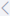

# Reporte de Evaluaciones

Dentro de la opción de Reporte de Evaluaciones, obtienes una herramienta para generar informes detallados sobre las evaluaciones de las asignaturas. Este informe es altamente personalizable, ya que puedes aplicar filtros según tus necesidades, como generación, estudiante o grupo específico, tipo de evaluación, ciclo, y selección de asignaturas en específico. El documento resultante se genera en formato Excel (.xlsx), proporcionándote una visión estructurada y detallada de las evaluaciones académicas.

## Genera un Reporte de Evaluaciones

:::info GENERA REPORTES SIGUIENDO ESTOS PASOS:

1. Ingresa al módulo "**Control Escolar**" y selecciona "**Reportes**" en el menú de **Funcionalidades**.

2. Selecciona la opción "**Reportes de Evaluaciones**".

3. Busca filtrando por **Generación**, por **Estudiante** o **Grupo**, **Tipo de Evaluación**, **Grupo** Y **Ciclo**.

4. En el listado de **Asignaturas** busca las que deseas que se muestren en el reporte.

  📌***Nota:*** Para adicionar **Asignaturas**, selecciona una y haz clic en "". Para quitar una **Asignatura**, selecciona "".

  📌***Nota:*** Para agregar todas las **Asignaturas** selecciona "". Para quitar de la lista todas las **Asignaturas**, selecciona "".

4. Una vez seleccionadas las **Asignaturas**, puedes generar el reporte de Excel. Selecciona "" para generar el documento de Excel.
:::
 
___

:::caution IMPORTANTE
Los datos que contienen "✱" son obligatorios.
:::

:::tip ¿Necesitas más ayuda?
Recuerda escribirnos si tienes inquietudes sobre este u otros procesos en **Gedux**. Nuestro **Equipo de Soporte** está listo para ayudarte.
:::

export const Highlight = ({children, color}) => (
  
    {children}
  
);

¿Te resultó útil este artículo? <Highlight color="#B0AEAC">[Si](https://forms.gle/LP9LYvbSWSSDwAau7)</Highlight> <Highlight color="#B0AEAC">[No](https://forms.gle/LP9LYvbSWSSDwAau7)</Highlight> 
